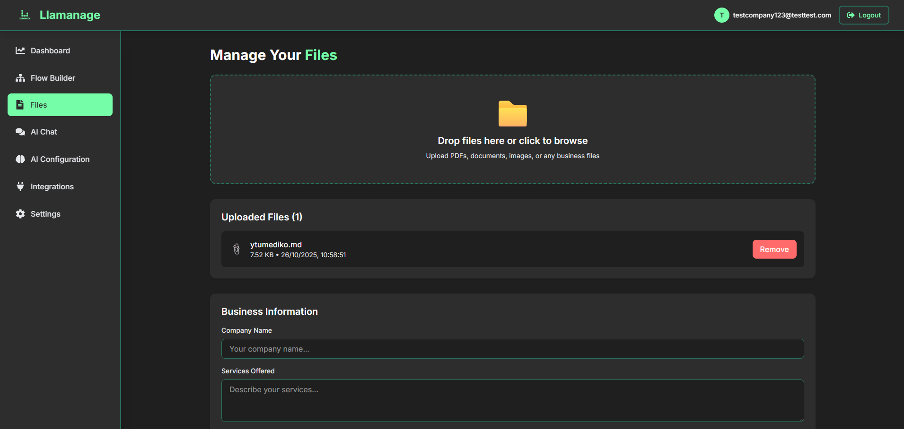

<div align="center">

# 🦙 Llamanage

### AI-Powered Health Tourism Assistant Platform

**Transform medical tourism patient support with intelligent AI agents specialized for healthcare services**

[](https://reactjs.org/)
[](https://vitejs.dev/)
[](https://tailwindcss.com/)
[](https://supabase.com/)
[](LICENSE)

[Demo](#-demo) • [Features](#-features) • [Installation](#-installation) • [Documentation](#-documentation) • [Team](#-team)

</div>

---

## 🎯 Overview

**Llamanage** is a specialized B2B SaaS platform designed for the **health tourism industry**. It enables hospitals, dental clinics, and medical tourism agencies to create AI-powered patient support agents that handle inquiries, appointment scheduling, and multilingual communication—helping international patients navigate medical procedures abroad.

### The Health Tourism Challenge
- 🌍 **Language barriers** between patients and medical providers
- 📞 **24/7 inquiries** from different time zsones worldwide
- 💰 Healthcare facilities spend **thousands** on multilingual support staff
- ⏰ Average response time of **12+ hours** loses potential patients
- 🏥 Complex medical procedures require detailed, accurate information

### Our Solution for Healthcare
- 🌐 **Multilingual AI agents** that understand medical terminology in 50+ languages
- 🗓️ **Automated appointment scheduling** with Google Calendar integration
- 🏥 **Medical procedure information** from your facility's documents
- 💬 **Instant responses** to patient inquiries - automatically in their language
- 🎙️ **Voice-enabled consultations** with natural multilingual speech
- 🧠 **Quick setup** via AI Configuration (no coding needed) OR advanced Flow Builder for custom workflows
- 📋 **HIPAA-compliant** architecture with enterprise security
- 💵 Reduce patient support costs by up to **70%**

> **Multilingual by Design**: Built specifically for international health tourism - patients from Turkey, Germany, UK, UAE, and beyond can communicate in their native language while you manage everything from one dashboard.

---

## � Screenshots

<div align="center">

### Landing Page & Authentication


### Dashboard Overview


### Visual Flow Builder (Zero-Code)


### AI Configuration Dashboard


### File Upload & Management


### Google Calendar Integration


</div>

---

##  Table of Contents

<details>
<summary>Click to expand</summary>

- [Overview](#-overview)
- [Screenshots](#-screenshots)
- [Features](#-features)
- [Use Cases](#-use-cases)
- [Tech Stack](#-tech-stack)
- [Installation](#-installation)
- [Usage Guide](#-usage-guide)
- [Project Structure](#-project-structure)
- [Documentation](#-documentation)
- [Team](#-team)
- [Contributing](#-contributing)
- [License](#-license)

</details>

---

## ✨ Features

### 🎨 Visual Flow Builder for Healthcare Conversations (Optional)
Build **medical consultation flows** with zero code using our drag-and-drop editor powered by React Flow.

> **Note**: The Flow Builder is completely optional! Clinics can skip this and simply use the **AI Configuration** tab to customize their agent's personality, voice, and behavior. The AI will intelligently handle patient conversations based on your uploaded documents and configuration settings.

**7 Node Types for Healthcare Workflows:**
- 🚀 **Start Node** - Patient conversation entry point
- 💬 **Message Node** - Send medical information and greetings
- ❓ **Question Node** - Collect patient details (symptoms, preferences, dates)
- 🔀 **Condition Node** - Branch based on medical procedures or patient needs
- ⚡ **Action Node** - Schedule appointments, send confirmations, create tickets
- 🤖 **AI Response Node** - Answer medical tourism questions intelligently
- 🏁 **End Node** - Complete patient interaction

### 🏥 Medical Document Intelligence
- **Upload medical procedures** (PDF, DOCX, TXT, CSV, MD)
- Store **facility information**, pricing, surgeon bios
- **Treatment descriptions** and recovery timelines
- **Vector embeddings** for smart medical content search (384 dimensions)
- Semantic search across your healthcare documents

### 💬 Multilingual Real-Time Patient Chat
- **WebSocket subscriptions** for instant patient responses
- **Persistent conversation history** for follow-ups
- Typing indicators for natural interaction
- **Context-aware medical responses**
- **Multilingual support for 50+ languages** - Essential for international health tourism patients
- Automatic language detection and response in patient's preferred language
- Medical terminology translation across languages

### 🗓️ Medical Appointment Scheduling
- **Google Calendar integration** (OAuth implemented)
- Check doctor/surgeon availability
- **Automated booking confirmations**
- Time zone handling for international patients
- Email reminders and follow-ups

### 🎙️ Voice-Enabled AI Consultations
- **Real-time voice calls** with AI assistant using Daily.co
- **Natural text-to-speech** powered by ElevenLabs (11 voices)
- **Live call transcription** for record-keeping
- **Multilingual voice support** (50+ languages)
- **Auto-generated call rooms** - Backend creates unique Daily.co URLs via API (`llamanage.daily.co/[room-id]`)
- **Embeddable on your website** - Add voice consultation widget with simple HTML code
- Automated call routing and after-hours handling
- WebRTC technology for crystal-clear audio quality

### 🧠 AI Configuration Dashboard (Quick Setup Alternative)
**No coding or flow building required!** Clinics can get started in minutes by simply:
- **Customize AI personality** (Professional Medical, Warm & Empathetic, Friendly & Casual, etc.)
- **System prompt editor** - Define AI behavior for your specific facility
- **Voice selection** - Choose from 11 ElevenLabs voices (Sarah, Laura, Charlie, etc.)
- **Temperature control** - Adjust AI creativity (0.0-1.0)
- **Language settings** - Set primary language for international patients (English, Spanish, French, German, Turkish, Arabic, Portuguese, Russian, Italian, Chinese, Japanese, etc.)
- **Response style** - Concise, Balanced, or Detailed
- **Max tokens configuration** - Control response length
- **Toggle AI features** - Enable/disable RAG and AI tools
- All settings persist to database per user
- **Embeddable widgets** - Get HTML code to embed chat widget on your website
- **Voice call links** - Auto-generated Daily.co URLs (`llamanage.daily.co/[room-id]`) for voice consultations

> **Perfect for health tourism**: Set your facility's primary language to match your patient demographic (e.g., Turkish clinics can set Turkish as primary, but AI responds in patient's language automatically)

### 🔐 HIPAA-Compliant Security
- **JWT authentication** with automatic refresh
- **Google OAuth** for secure access
- **Row Level Security (RLS)** protecting patient data
- httpOnly cookies (XSS protection)
- **Private file storage** per healthcare facility
- Environment-based secrets management

### 🔗 Healthcare Integrations
- ✅ **Google Calendar** (Schedule consultations)
- 🚧 **Slack** (Team notifications)
- 🚧 **Discord** (Community support)
- 🚧 **Gmail** (Patient communications)
- 🚧 **Notion** (Documentation)
- 🚧 **Calendly** (Appointment booking)

### 📊 Healthcare Facility Dashboard
**7 Management Sections:**
1. **Overview** - Patient inquiry stats and quick actions
2. **Flow Builder** - Design medical conversation flows
3. **Files** - Medical documents and procedure info
4. **Chat** - Patient interaction interface
5. **Voice Calls** - Real-time voice consultation management
6. **AI Configuration** - Customize AI personality, voice, and behavior
7. **Integrations** - Calendar and communication tools
8. **Settings** - Facility profile and preferences

### 🎨 Healthcare-Focused UI/UX
- **Medical-grade dark theme** with calming colors (#2D2D2D, #75FDA8, #27705D)
- **Fully responsive** for desktop and mobile use
- Smooth animations for professional feel
- **Tailwind CSS v4** with custom healthcare palette
- Accessible design for diverse patient demographics

---

## 🏥 Use Cases

### International Dental Clinics
- Answer patient questions about **dental implants**, veneers, root canals
- Provide **pricing in multiple currencies**
- Schedule consultations across **time zones**
- Send pre-appointment instructions in patient's language

### Cosmetic Surgery Centers
- Explain procedures (rhinoplasty, liposuction, facelifts)
- Share **before/after galleries** and surgeon credentials
- Handle post-op follow-up questions
- Coordinate **travel and accommodation** for international patients

### Fertility Clinics
- Answer sensitive IVF and fertility treatment questions
- Provide **detailed treatment timelines**
- Schedule consultations with specialists
- Offer multilingual support for global patients

### Medical Tourism Agencies
- Compare **multiple hospitals** and procedures
- Provide **package deals** (surgery + hotel + transport)
- Handle visa and travel documentation questions
- 24/7 support for patients during their medical journey

---

## 🛠️ Tech Stack

### Frontend
| Technology | Version | Purpose |
|------------|---------|---------|
| **React** | 19.1.1 | Modern UI library with latest features |
| **Vite** | 7.1.7 | Lightning-fast build tool and dev server |
| **Tailwind CSS** | v4 | Utility-first CSS with `@tailwindcss/vite` |
| **React Router** | 7.9.4 | Client-side routing and navigation |
| **React Flow** | 11.11.4 | Visual node-based flow editor |
| **React Icons** | 5.5.0 | Icon library |

### Backend & Database
| Technology | Purpose |
|------------|---------|
| **Supabase** | Complete backend-as-a-service platform |
| **PostgreSQL** | Primary relational database (15+) |
| **pgvector** | Vector similarity search (384 dimensions) |
| **Supabase Auth** | JWT authentication + OAuth providers |
| **Supabase Storage** | S3-compatible object storage |
| **Supabase Realtime** | WebSocket subscriptions |
| **Supabase Edge Functions** | Serverless functions for AI processing |

### AI & Voice Services
| Technology | Purpose |
|------------|---------|
| **OpenRouter** | LLM API access (Llama 3.3-70B) |
| **HuggingFace** | Text embeddings (sentence-transformers/all-MiniLM-L6-v2) |
| **Daily.co** | WebRTC voice/video calls with transcription |
| **ElevenLabs** | Multilingual text-to-speech (11 voices, 50+ languages) |

### Document Processing
| Technology | Purpose |
|------------|---------|
| **pdfjs-dist** | PDF text extraction |
| **mammoth** | DOCX document processing |
| **Custom parsers** | CSV, TXT, MD, JSON support |

### Development Tools
- **ESLint** - Code quality and consistency
- **Git** - Version control
- **npm** - Package management
- **VS Code** - Recommended IDE

### Healthcare-Specific Features
- **Multilingual support** (Architecture ready for 50+ languages)
- **HIPAA-compliant architecture** (RLS, encryption, audit logs)
- **Medical terminology** support in AI responses
- **Appointment scheduling** with timezone handling
- **Secure file storage** for medical documents

---

## 🚀 Installation

### System Requirements
- **Node.js**: Version 18.0.0 or higher
- **npm**: Version 9.0.0 or higher
- **Git**: Latest version
- **Operating System**: Windows 10+, macOS 10.15+, or Linux

### Quick Start

```bash
# 1. Clone the repository
git clone https://github.com/Convgen/LLamanage-METALLAMAHACKATHON.git
cd llamanage

# 2. Install dependencies
npm install

# 3. Set up environment variables
cp .env.example .env
# Edit .env with your Supabase credentials

# 4. Start development server
npm run dev
```

Visit `http://localhost:5173` to see the application!

### Detailed Setup

For complete setup instructions including Supabase configuration, see:
- **[SUPABASE_SETUP.md](./SUPABASE_SETUP.md)** - Complete backend setup
- **[JUDGE_QUICKSTART.md](./JUDGE_QUICKSTART.md)** - 5-minute quick start guide

---

## 📘 Usage Guide

### For Healthcare Facilities

#### 1. Create Your Facility Account
1. Visit the landing page
2. Click "Get Started"
3. Enter facility details (email, password, facility name)
4. Access your healthcare dashboard

#### 2. Upload Medical Documents
1. Go to **Files** tab
2. Upload your procedure descriptions, pricing lists, surgeon bios
3. Supported formats: PDF, DOCX, TXT, CSV, MD
4. Documents are automatically processed for AI training

#### 3. Configure Your AI Agent (Quick Setup - Recommended)
1. Go to **AI Configuration** tab (brain icon 🧠)
2. **Customize personality**:
   - Choose "Professional Medical" for formal clinics
   - Choose "Warm & Empathetic" for fertility/cosmetic surgery clinics
   - Or select Custom and define your own
3. **Set system prompt**: 
   - Example: "You are a dental clinic assistant specializing in implants and cosmetic dentistry for international patients"
4. **Select voice** (for phone calls):
   - Choose from 11 ElevenLabs voices
   - Example: "Sarah" for professional female voice
5. **Set primary language**:
   - Select your clinic's main language (English, Spanish, Turkish, Arabic, etc.)
   - AI will auto-detect patient language and respond appropriately
6. **Adjust settings**:
   - Temperature: 0.7 for balanced responses (lower = more focused, higher = more creative)
   - Max tokens: 500 for standard responses
   - Enable RAG: ✅ (searches your uploaded documents)
   - Enable AI Tools: ✅ (allows calendar booking, ticket creation)
7. Click **Save Changes**

> **That's it!** Your AI agent is ready. No coding or flow building required.

#### 4. (Optional) Design Patient Conversation Flows
**For advanced users who want custom conversation logic:**
1. Go to **Flow Builder** tab
2. Create flows for common inquiries:
   - "Dental Implant Consultation"
   - "Pricing Information Request"
   - "Appointment Booking"
3. Use 7 node types to build logic
4. Save flows - they auto-sync to database

> **Note**: Most clinics don't need this. AI Configuration handles most use cases automatically.

#### 5. Connect Google Calendar
1. Go to **Integrations** tab
2. Click "Connect" on Google Calendar
3. Authorize access
4. AI can now schedule patient appointments automatically

#### 6. Test Your AI Agent
1. Go to **Chat** tab
2. Ask questions as a patient would:
   - "How much do dental implants cost?"
   - "Can I schedule a consultation?"
   - "What's the recovery time?"
   - Try in different languages: "¿Cuánto cuesta un implante dental?" (Spanish)
3. Review responses and refine AI Configuration if needed

### For International Patients

Patients interact with your AI agent through:
- **Embeddable chat widget** on your website
- **Direct link** to chat interface
- **WhatsApp/SMS integration** (coming soon)

---

## 📁 Project Structure

```
llamanage/
├── src/
│   ├── components/              # React components
│   │   ├── ChatInterface.jsx    # Patient chat UI
│   │   ├── DashboardOverview.jsx
│   │   ├── FilesManager.jsx     # Medical document uploads
│   │   ├── FlowBuilder.jsx      # Visual flow editor
│   │   ├── IntegrationsManager.jsx
│   │   └── SettingsPanel.jsx
│   │   └── AIConfiguration.jsx 
│   ├── pages/                   # Route pages
│   │   ├── Dashboard.jsx        # Main facility dashboard
│   │   ├── LandingPage.jsx      # Public landing page
│   │   ├── SignIn.jsx
│   │   └── SignUp.jsx
│   ├── utils/                   # Utility functions
│   │   ├── supabaseClient.js    # Supabase helpers
│   │   ├── documentProcessor.js # PDF/DOCX extraction
│   │   └── googleCalendar.js    # Calendar API
│   ├── assets/                  # Images and static files
│   ├── App.jsx                  # Main app component
│   ├── main.jsx                 # App entry point
│   └── index.css                # Global styles + Tailwind
├── supabase/                    # Backend configuration
│   ├── functions/               # Edge Functions
│   └── migrations/              # Database migrations
├── public/                      # Public assets
├── docs/                        # Documentation
│   └── screenshots/             # UI screenshots
├── extra_files/                 # Additional documentation
├── .env.example                 # Environment template
├── vite.config.js               # Vite configuration
├── package.json                 # Dependencies
├── SUPABASE_SETUP.md            # Backend setup guide
└── README.md                    # This file
```

---

## 📖 Documentation

### Getting Started
- **[SUPABASE_SETUP.md](./SUPABASE_SETUP.md)** - Complete Supabase backend setup
- **[JUDGE_QUICKSTART.md](./JUDGE_QUICKSTART.md)** - 5-minute quick start
- **[QUICK_REFERENCE.md](./QUICK_REFERENCE.md)** - API quick reference


---

## 👥 Team

**Llamanage** is built by a dedicated team specializing in healthcare technology:

### Core Team

#### 🎨 **Abdelrahman Elmorsi** - Fullstack Developer & Project Lead
- React 19 architecture and implementation
- Visual Flow Builder with React Flow (7 node types)
- Responsive healthcare UI with Tailwind CSS v4
- Project coordination and timeline management

**Key Contributions**: Flow Builder, Landing Page, Dashboard routing

#### 🤖 **Nabil** - AI & Backend Engineer
- Medical AI conversation logic
- Document processing for healthcare files
- Supabase client utilities
- Real-time chat backend
**Key Contributions**: Database design, Auth system, Security

#### 🧠 **Yasir** - AI & Backend Engineer
- Supabase backend architecture
- Database schema with HIPAA-compliant RLS policies
- JWT authentication + Google OAuth
- Vector search setup (pgvector)

**Key Contributions**: AI logic, Document processor, API integration

#### 🎨 **Abdullah Mazloum** - UI/UX Designer
- Healthcare brand identity
- Medical-focused color palette (#2D2D2D, #75FDA8, #27705D)
- User flows for patient interactions
- Accessible design for diverse demographics

**Key Contributions**: Design system, Brand colors, UX flows

---

## 📄 License

Proprietary - All rights reserved © 2025 Certifi Team

---

## 📞 Support

- 📧 **Email**: abdelrahman.elmorsi.20@gmail.com
- 📚 **Documentation**: [SUPABASE_SETUP.md](./SUPABASE_SETUP.md)
- 🐛 **Bug Reports**: [Open an issue](https://github.com/Convgen/LLamanage-METALLAMAHACKATHON/issues)
- 💡 **Feature Requests**: [Submit your ideas](https://github.com/Convgen/LLamanage-METALLAMAHACKATHON/discussions)

---

## 🙏 Acknowledgments

- **React Team** - For React 19
- **Vite Team** - For blazing-fast builds
- **Tailwind Labs** - For Tailwind CSS v4
- **Supabase Team** - For the amazing backend platform
- **React Flow Team** - For the visual node editor
- **Healthcare Community** - For feedback and insights

---

<div align="center">

**🦙 Llamanage** - Making healthcare accessible to international patients

Built with ❤️ for the health tourism industry by the Certifi team

[](https://github.com/Convgen/LLamanage-METALLAMAHACKATHON)

</div>
